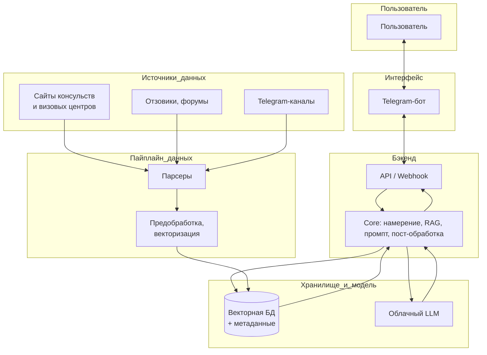

# Design-Doc: LLM-based project — Бот-консул

## 1. Контекст проекта

### 1.1 Бизнес-задача

**Описание проблемы:** Граждане РФ, планирующие поездку за рубеж, сталкиваются с разрозненной и быстро устаревающей информацией о визах: официальные сайты консульств и визовых центров, множество форумов и отзывов, актуальные советы в Telegram-каналах. Собрать полную картину — какие документы нужны, куда подавать, какие подводные камни — трудоёмко и часто приводит к ошибкам и отказам.

**Почему решение имеет смысл:** Бот-консул агрегирует официальные инструкции, парсит отзывы недавно получивших визу, извлекает информацию из релевантных Telegram-каналов и даёт пользователю структурированные ответы: пошаговые инструкции, ссылки на сайты для заполнения документов, советы по документам для въезда помимо визы (страховка, билеты, подтверждение проживания и т.д.). Это снижает информационную перегрузку и риск ошибок при подготовке к поездке.

**Критерии успеха с точки зрения бизнеса:** Низкий процент ответов с фактическими ошибками. Рост числа пользователей, получивших визу с первой попытки; сокращение времени на поиск информации; положительные отзывы и повторное использование бота при следующей поездке. Метрики: конверсия «запрос → полезный ответ», NPS, доля пользователей, отметивших ответ как полезный. 

**Почему без чат-бота не справиться:** Объём и разнородность источников (официальные сайты, отзывы, Telegram) делают ручной поиск долгим и ненадёжным. LLM + RAG позволяют давать персонализированные ответы под конкретную страну и тип визы в режиме диалога.

### 1.2 Целевая аудитория и пользователи

**Кто будет пользоваться:** Граждане России, планирующие поездку за границу и нуждающиеся в информации о визах и документах для въезда. Возможны также внутренние пользователи (турагентства, визовые центры) при расширении продукта.

**Сценарии использования:** Текстовый чат в мессенджере (Telegram-бот как основной интерфейс), опционально — веб-виджет или мобильное приложение. Пользователь указывает страну назначения (и при необходимости тип визы), задаёт вопросы в свободной форме и получает инструкции, ссылки и советы из отзывов и каналов.

**Нагрузка:** Оценка — тысячи сессий в месяц на старте; пиковые часы — вечер и выходные, когда люди планируют поездки. Масштабирование за счёт асинхронной обработки и кэширования частых запросов.

**Цена ошибки:** Высокая — неверная информация может привести к отказу в визе или задержкам. Ответы должны содержать ссылки на официальные источники и явно помечать советы из отзывов как неофициальные.

### 1.3 Ограничения и допущения

**Что не делаем:** Не даём юридических консультаций и не гарантируем выдачу визы; не подменяем официальные консульства и визовые центры. Не интегрируемся с платёжными системами и не принимаем документы от пользователя (только информирование).

**Допущения:** Пользователи формулируют запросы на русском языке; основные источники — русскоязычные (официальные сайты с переводами/версиями, отзывы, Telegram). Данные из парсинга считаются публичными (отзывы, посты в открытых каналах). Инфраструктура позволяет хранить и индексировать тексты; соблюдаются требования к обработке персональных данных при логировании диалогов.

**Репутационные риски:** Ответы только в рамках виз и документов для въезда; при неуверенности модель должна рекомендовать обратиться в консульство или визовый центр.

## 2. Архитектура решения

### 2.1 Общая схема

**Компоненты:**

- **Фронт-энд:** Telegram-бот (чат-интерфейс).
- **API-слой:** приём сообщений от Telegram, аутентификация, маршрутизация запросов к core.
- **Core:** обработка запроса пользователя — определение страны/типа визы, поиск по хранилищу знаний (RAG), если данных из хранилища знаний не хватает или они подкрепляются старыми источниками, запускается поиск в интернете, формирование контекста для LLM, вызов LLM, пост-обработка ответа (проверка ссылок, форматирование).
- **Хранилище знаний:** векторная БД (embeddings официальных инструкций, отзывов, выдержек из Telegram) + метаданные (страна, тип визы, дата, источник).
- **LLM:** модель полностью опирается на облачный LLM для генерации ответов по контексту. В облачный LLM не передаются персональные или идентифицирующие пользователя данные — только анонимизированный контекст (обезличенный запрос, фрагменты из базы знаний).
- **Парсеры и пайплайны:** сбор данных с сайтов визовых центров/консульств, парсинг отзывов (например, отзовики, форумы), парсинг релевантных Telegram-каналов; предобработка и загрузка в хранилище.

**Порядок обработки запроса:** сообщение пользователя → извлечение намерения (страна, тип визы) → поиск релевантных фрагментов в хранилище → сбор контекста (официальные инструкции + отзывы + выдержки из каналов) → формирование промпта → вызов LLM → пост-обработка и отправка ответа в чат.

**Где что лежит:** БД (векторная + метаданные) — отдельный сервис/облако; промпты — в конфигурации core-сервиса или в отдельном репозитории шаблонов.

### 2.2 Хранилище знаний / документооборот

**Источники знаний:**

- Официальные сайты консульств и визовых центров (инструкции, списки документов, ссылки на подачу).
- Парсинг отзывов пользователей, недавно получивших визу (советы, типичные ошибки, сроки).
- Релевантные Telegram-каналы (новости по визам, изменения правил, практические советы).

**Предобработка:** парсинг HTML/API страниц и постов; нормализация текста (язык, кодировка); категоризация по стране, типу визы, типу документа (официальная инструкция / отзыв / пост из канала); сегментация на смысловые блоки для индексации.

**Индексация:** векторизация через embedding-модель (multilingual для русского и английского); ключевые слова и метаданные (страна, тип визы, дата обновления, источник); при поиске — гибрид (семантика + фильтры по метаданным).

**Обновление:** периодический парсинг официальных сайтов и каналов (например, раз в сутки/неделю в зависимости от источника); новые отзывы — по расписанию или по триггеру; версионирование документов по дате для отсечения устаревшего. Если при поиске обнаруживаются новые данные, они добавляются в хранилище. Хранение: объектное хранилище для сырых текстов, векторная БД для индекса. Обновление — автоматизированные пайплайны (парсинг + препроцессинг + переиндексация), при необходимости — ручная модерация списка каналов и источников.

### 2.3 Интеграции и интерфейсы

**Внешние API и сервисы:** Telegram Bot API (входящие сообщения, отправка ответов); при необходимости — API визовых центров для актуальных ссылок; 

**Протоколы:** REST для внутренних сервисов, Webhook для Telegram; опционально WebSockets для веб-чата.

**UI/UX:** чат в Telegram с кнопками выбора страны/типа визы для быстрого старта; текстовые ответы с разметкой (заголовки, списки, ссылки); при отсутствии ответа — предложение уточнить запрос или обратиться в консульство. Возможность оценить полезность ответа по кнопке в интерфейсе Telegram.

**Мониторинг:** логирование запросов и ответов (без персональных данных в открытом виде), метрики латентности и ошибок, алерты при падении парсеров или росте доли офтопик-запросов.

### 2.4 Инфраструктура и развертывание

**Стек:** упрощённый вариант на одной VM

**Среды:** dev, prod; конфигурация по средам (токены Telegram, ключи LLM, БД).

**Вычисления:** CPU достаточно для embedding и большинства сценариев; при больших объёмах индекса — увеличение памяти; генерация ответов — только через облачный LLM (локальные модели не используются). Перед вызовом облачного API контекст обезличивается: в LLM не передаются идентифицирующие пользователя данные.

**Безопасность:** без хранения паролей пользователей (Telegram ID как идентификатор); шифрование соединений; соблюдение политик при логировании (анонимизация при необходимости). Персональные данные не попадют в хранилище. Масштабирование — горизонтальное за счёт нескольких инстансов бота и отдельного сервиса RAG.

## 3. Данные и качество знаний

**Чувствительность:** Модель полностью опирается на облачный LLM; передавать в него персональные или идентифицирующие пользователя данные мы не можем. В облачный LLM отправляется только анонимизированный контекст: обезличенный текст запроса и релевантные фрагменты из базы знаний (официальные инструкции, отзывы, выдержки из каналов) без привязки к пользователю. Официальные инструкции и публичные посты/отзывы в базе знаний не содержат персональных данных; при логировании диалогов — минимизация и анонимизация.

### 3.1 Сбор и предобработка данных

**Источники:** HTML страницы консульств и визовых центров; страницы с отзывами (структурированный парсинг или API); экспорт/парсинг публичных Telegram-каналов (в рамках ToS и ограничений платформы). Форматы: HTML, JSON, текст.

**Предобработка:** токенизация и очистка (удаление навигации, рекламы); выделение сущностей (названия стран, типы виз, даты); сегментация на абзацы/блоки для embedding.

**Метаданные:** теги (страна, тип визы, тип источника), дата сбора, URL/идентификатор канала, тип контента (официальный / отзыв / канал).

### 3.2 Векторизация и индексирование

**Embedding:** multilingual модель (например, sentence-transformers для русского и английского), при необходимости — доменная дообучение на визовой лексике.

**Индекс:** размерность векторов по модели; метрика — cosine similarity; при росте объёма — разбиение по странам/типам виз (shards) для ускорения поиска.

**Обновление:** инкрементальное добавление новых документов; периодическая пересборка индекса при массовом обновлении источников.

### 3.3 Метрики качества знаний

**Покрытие:** доля целевых направлений, по которым в базе присутствуют чанки всех трёх типов - официальные источники, отзывы/тг-каналы.

**Актуальность:** частота обновления источников; время с момента изменения на сайте до появления в индексе. Нет источников старше, чем полгода. Если источнику не было обращений более полугода, то он удаляется из хранилища.

**Консистентность:** дедупликация одинаковых фрагментов; выявление противоречий между источниками (официальные vs отзывы) и явная разметка в ответах.

**Проверка:** выборочная ручная ревизия ответов; тестовый набор запросов по странам/визам; A/B тесты формулировок и источников контекста.

## 4. Модель и генерация

### 4.1 Выбор LLM и промптинг

**Модель:** решение полностью опирается на облачный LLM; локальные модели не используются. Выбор конкретного облачного API — по соотношению качества, скорости и стоимости (например, Gemini 3 flash и т.п.). В облачный LLM не передаются персональные или идентифицирующие пользователя данные — только обезличенный запрос и фрагменты из RAG. Важна поддержка русского языка и способность следовать инструкциям (структура ответа, ссылки, оговорки об неофициальных советах).

**Промпт-шаблоны:** системный промпт (роль бота-консула, границы — только информирование), контекст — подставленные фрагменты из RAG (официальные инструкции, отзывы, выдержки из каналов), инструкции по формату (списки, ссылки, выделение официальных и неофициальных советов). Ограничения: максимальная длина ответа (например, 1000–1500 токенов), таймаут генерации.

### 4.2 Контроль качества ответов

**Метрики:** Отсутствие выдуманных фактов (hallucinations),релевантность ответа запросу, наличие ссылок на официальные источники,. Сбор явной обратной связи (лайк/дизлайк, «ответ помог»).

**Ошибки:** нежелательные ответы (офтопик, юридические гарантии), галлюцинации (несуществующие ссылки, даты). Механизмы: проверка ссылок перед отправкой, fallback на «уточните страну/тип визы» или «обратитесь в консульство» при низкой уверенности; ручной ревью выборки диалогов.

### 4.3 Обучение/дообучение

На первом этапе — без fine-tuning, использование готовой модели и RAG. При накоплении размеченных диалогов возможен fine-tuning на парах «запрос — идеальный ответ» или RLHF для тона и формата. Версионирование промптов и моделей, план отката на предыдущую версию при деградации метрик.

## 5. UX / пользовательский опыт

### 5.1 Сценарии взаимодействия

**Основные:** приветствие и краткое описание возможностей; выбор страны (и при необходимости типа визы) через кнопки или текст; поиск по знаниям и выдача инструкций + ссылок + советов из отзывов и каналов; уточняющие вопросы в рамках многотурового диалога (например, «какие документы кроме визы?», «где заполнять анкету?»).

**Исключительные:** нет релевантной информации в базе — сообщение об этом + рекомендация обратиться на сайт консульства/визового центра; запрос не по теме — вежливый отказ и напоминание темы бота; **запросы, направленные на обман визового центра/консульства или нарушение закона** — однозначный отказ без обсуждения, напоминание о том, что бот помогает только с легальным оформлением (подробнее см. разд. 6); технический сбой — извинения и предложение повторить запрос или вернуться позже; при необходимости — контакты поддержки (без обещания консультации по визам).

### 5.2 Диалоговая логика

**Состояния:** multi-turn — учёт последних реплик в рамках сессии для контекста «страна / тип визы / текущий вопрос». Можно сбросить контекст.

**Память:** в рамках сессии — хранение выбранной страны и типа визы; долгосрочная память пользователя на первом этапе не обязательна, при расширении — сохранение предпочтений (язык, страна по умолчанию).

**Стиль:** нейтральный, вежливый, информативный; структурированные ответы (заголовки, списки), ссылки кликабельны; эмодзи — по минимуму, только для улучшения читаемости (например, галочки в чек-листах).

### 5.3 Метрики UX

Время до первого ответа (целевое — несколько секунд), доля возвратов пользователей, NPS или рейтинг полезности ответа, доля сессий с явной положительной обратной связью. Логирование взаимодействий (анонимизированно) для анализа качества и дообучения. Желательна быстрая обратная связь (лайк/дизлайк или кнопка «Помогло»).

## 6. Безопасность, соответствие и этика

Минимум персональных данных; в облачный LLM передаётся только анонимизированный контекст. Бот не оказывает содействия обману визового центра/консульства, подделке документов, сокрытию фактов и иным нарушениям закона — при таких запросах однозначный отказ и напоминание о легальном оформлении (в промпте и при необходимости префильтрации). Соблюдение законодательства РФ и страны въезда; не даём советов по обходу визовых правил. Офтопик и вредоносный контент блокируются. В описании бота указано, что это помощник по информированию, а не замена консульства; ответственность за использование информации — на пользователе. Политики мессенджера и при необходимости GDPR соблюдаются.

## 7. План внедрения и эксплуатации

### 7.1 Этапы проекта

- **Фаза 0:** исследование и документирование — фиксация списка стран и источников (официальные сайты, отзовики, Telegram-каналы), дизайн документа (текущий документ).
- **Фаза 1 — MVP:** минимальный бот в Telegram, парсинг 2–3 стран, базовая RAG, простая диалоговая логика, ответы с инструкциями и ссылками + несколько отзывов/каналов.
- **Фаза 2:** расширение — больше стран, полный парсинг отзывов и каналов, улучшение промптов и метаданных RAG, кнопки и сценарии выбора страны/визы.
- **Фаза 3:** масштабирование и оптимизация — производительность, мониторинг, A/B тесты, при необходимости fine-tuning и расширение каналов (веб, приложение).

Вехи и сроки задаются командой; ответственные — продукт, ML/NLP, бэкенд, парсинг/данные.

### 7.2 Поддержка и эксплуатация

Ответственность: команда продукта + разработка (SRE/DevOps при масштабировании). Мониторинг: логи ошибок, SLA по доступности и латентности, алерты при падении парсеров или росте ошибок LLM. Обновление знаний: расписание парсинга, ревью новых источников и каналов. Метрики: uptime, средняя задержка ответа, стоимость на сессию (API LLM, инфраструктура).

## 8. Риски и допущения

**Риски:** неточные или устаревшие ответы (митигация — приоритет официальных источников, даты в метаданных, периодическое обновление); недостаточное покрытие стран или типов виз (поэтапное расширение списка); изменения в ToS Telegram или ограничения парсинга каналов (резервные источники, ручное обновление); высокая стоимость LLM при росте трафика (кэш, более дешёвые модели, лимиты).

**Допущения:** пользователи в основном из РФ, запросы на русском; выбранные источники остаются доступными для парсинга; одна выбранная embedding-модель достаточна для качества поиска; облачная LLM доступна и приемлема по цене; архитектура строится с учётом того, что в облачный LLM мы не передаём персональные или идентифицирующие данные — только анонимизированный контекст.

## 9. Бюджет и ресурсы

**Люди:** продукт/аналитик, ML/NLP-инженер, бэкенд-разработчик, при необходимости — парсинг/данные, DevOps. Контент-менеджер — для курирования списка каналов и источников.

**Технологии:** облачный хостинг (VM/контейнеры), векторная БД, облачный API LLM (модель полностью в облаке; в API передаётся только обезличенный контекст), Telegram Bot API. Оценка затрат — в зависимости от объёма трафика и выбора облачной модели.

**ROI:** косвенно — экономия времени пользователей, снижение количества ошибок при подаче документов; при монетизации — доля платных подсказок или партнёрские ссылки (с соблюдением этики и прозрачности).

## 10. Приложения

**Термины:** RAG (Retrieval-Augmented Generation), embedding, векторная БД, парсинг, офтопик.

**Схема архитектуры проекта:**

